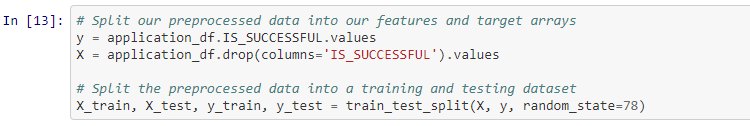
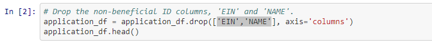
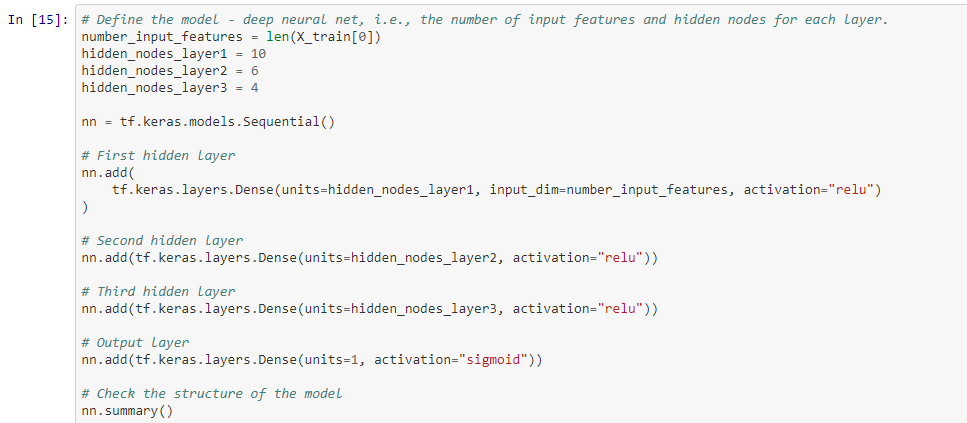

# Neural Network Charity Analysis

## **Overview:**
This project was an effort to test a Neural Network Model on data containing 34,000 charitable organizations. The desired outcome of the model was to be able to predict which organizations would be a sound investment for Alphabet Soup, a company that donates funding to charities. 

## **Results:** 

### ***Data Preprocessing***

    * The variable for the target of the model was the 'IS_SUCCESSFUL' column. 
    * The variables for the features of the model were the 'APPLICATION_TYPE', 'AFFILIATION', 'CLASSIFICATION',
    'USE_CASE', 'ORGANIZATION', 'STATUS', 'INCOME_AMT', 'SPECIAL_CONSIDERATIONS', and 'ASK_AMT' columns. 
    * The variables that were dropped were the 'EIN', and 'NAME' columns

  
             

 

### ***Compiling, Training, and Evaluating the Model***

    * The model that did the best in optimization had three hidden layers with descending amounts of neurons 
    as 10, 6, and 4. I used relu activation on each hidden layer and sigmoid on the output layer. 
    * I was not able to achieve the target performance of 75% and clocked out at 73% max. 
    * I attempted to add more neurons and test different activations and layers. However, the model 
    had no affect or change on more layers and was in danger of overfitting through the use of too 
    many neurons. Different activation functions also had little or no effect on the accuracy. 

  

## **Summary:** 
The accuracy levels of this model were not affective enough to reach the standards. Deep Learning Neural network would not be a recommended model to use for future predictions. I would suggest testing different models, such as Random Forest, to achieve a higher accuracy level.
